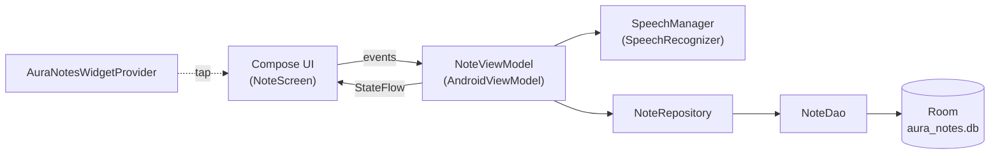

# Aura Notes

A **voice-first notes app for Android**, built with Kotlin and 100% Jetpack Compose. Speak a note, watch it transcribe on-device, and store it locally — no account, no backend, no network.


> Personal portfolio and learning project. Everything runs on-device.

## Features

- 🎙️ **Voice-first recording** — record a note and have it transcribed by Android's on-device `SpeechRecognizer` (uses the device locale). Listening continues across pauses, so thinking mid-sentence doesn't cut you off; you end the note with **Stop**.
- ✍️ **Text notes** too, from a quick dialog.
- 🗂️ **Categories** — Personal, Work, Ideas, Shopping, None — colour-coded with the brand palette.
- 🔍 **Search** — an expandable search field filters notes live.
- ⭐ **Favorites** — star notes and filter to just your favorites from a single-select filter row.
- 📤 **Share** — send a note's text through the Android share sheet.
- 💾 **Export to .txt** — export all notes to a text file via the system file picker (Storage Access Framework — no storage permission needed).
- 🏠 **Home-screen widget** — one tap opens the app and starts recording immediately.
- 🎨 **Branded theme** — a deliberate blue colour scheme (no Material You / wallpaper colours), light and airy.

## Privacy

All notes live in a local [Room](https://developer.android.com/training/data-storage/room) database on the device. There are **no network calls, no analytics, and no accounts** — transcription runs through Android's on-device speech recognition. The only runtime permission is `RECORD_AUDIO`, requested the first time you record.

## Tech stack

- **Kotlin** — no Java, no XML layouts (except the unavoidable widget `RemoteViews` layout)
- **Jetpack Compose** + **Material 3** for the entire UI
- **Room** (with **KSP**) for local persistence, with real schema migrations
- **Kotlin Coroutines / Flow / StateFlow**
- **AndroidViewModel** for state
- Android **`SpeechRecognizer`** for transcription
- **AppWidgetProvider** + **RemoteViews** for the home-screen widget
- **Storage Access Framework** for `.txt` export

### Toolchain

| Tool | Version |
| --- | --- |
| Android Gradle Plugin | 9.0.1 (built-in Kotlin) |
| Gradle | 9.2.1 |
| Kotlin | 2.2.10 |
| Compose BOM | 2025.12.00 |
| Room | 2.8.4 |
| KSP | 2.2.10-2.0.2 |
| Java | 11 |
| compileSdk / targetSdk | 36 |
| minSdk | 24 (Android 7.0) |

## Architecture

Strict **MVVM**, one direction of data flow:



The UI never touches data access directly; the ViewModel exposes immutable `StateFlow`s and the repository wraps the DAO.

### Project structure

```
dev.peterbot.auranotes
├── data/
│   ├── local/        NoteEntity, NoteDao, NoteDatabase, Category, Converters
│   └── repository/   NoteRepository
├── speech/           SpeechManager (wraps SpeechRecognizer)
├── viewmodel/        NoteViewModel, NoteFilter, NoteExporter
├── ui/               NoteScreen, CategoryUi, theme/
├── widget/           AuraNotesWidgetProvider
└── MainActivity.kt
```

## Getting started

### Requirements

- Android Studio (latest stable)
- JDK 11+
- An Android device or emulator running **API 24+** (a physical device is recommended for the microphone and the widget)

### Build & run

```bash
git clone https://github.com/ronnedahl/aura-notes-kotlin.git
cd aura-notes-kotlin

# Build the debug APK
./gradlew assembleDebug

# …or open the project in Android Studio and press Run.
```

Install the built APK on a connected device:

```bash
adb install -r app/build/outputs/apk/debug/app-debug.apk
```

### Using the widget

Long-press the home screen → **Widgets** → **AuraNotes** → drop the mic widget. Tapping it opens the app and starts recording right away.

## Roadmap

All planned features are implemented:

- [x] Local data layer + text notes
- [x] Voice recording (on-device `SpeechRecognizer`)
- [x] Categories + filter chips
- [x] Search + favorites
- [x] Share + `.txt` export
- [x] Home-screen widget for one-tap recording
- [x] Brand theme

## License

This is a personal portfolio project and is not currently published under an open-source license.

## Author

**Peter** ([@ronnedahl](https://github.com/ronnedahl)) — tested on a Samsung Galaxy A33 (Android 13/14).
